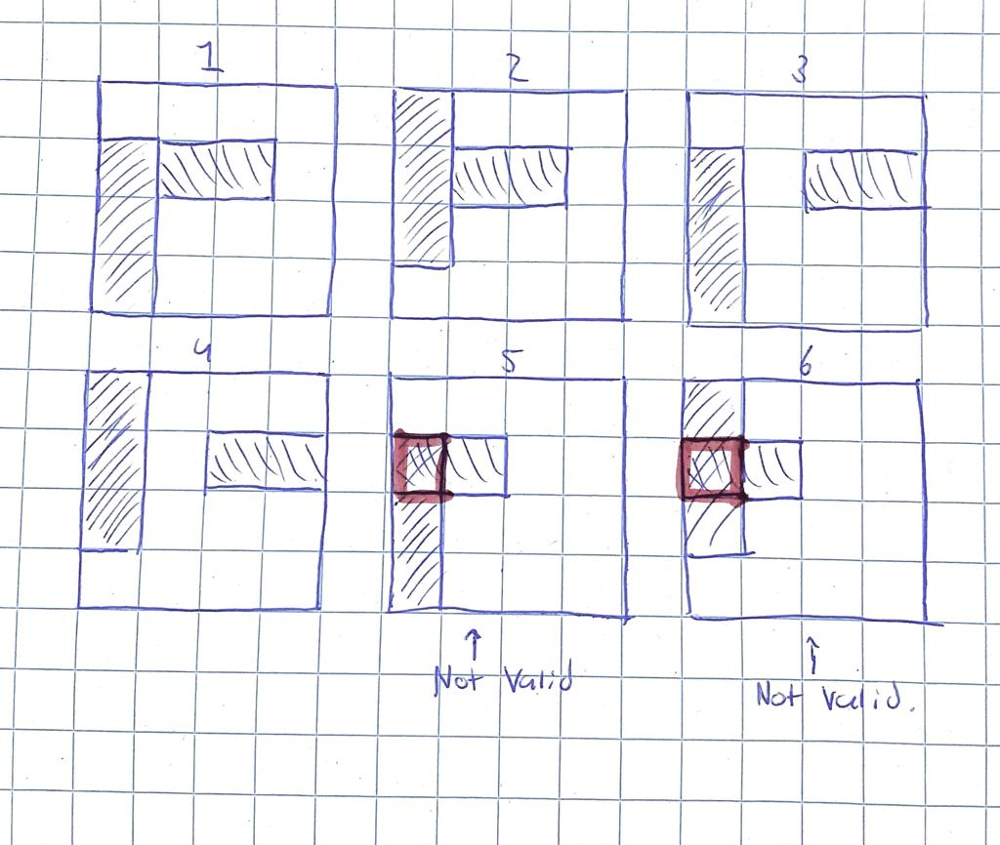
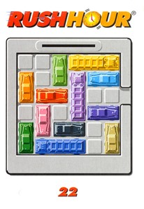

# RUSH HOUR

Voor deze case hebben wij algoritmes en heuristieken uitgewerkt en toegepast op het bordspel Rush Hour.
Het programma kan gerund worden voor verschillende speelborden, algoritmes en output geven van statistsche informatie omtrent de case.
Er kan uit de volgende algoritmes gekozen worden:
 - random: dit algoritme kiest willekeurig legale zetten
 - breadth: hierbij wordt gebruik gemaakt van een breadth first search
 - randombreadth: dit is een BFS
 - depth: hierbij wordt gebruikt gemaakt van een depth first search
 - beam: hierbij wordt gebruik gemaakt van een beam search

## BIJLAGEN

